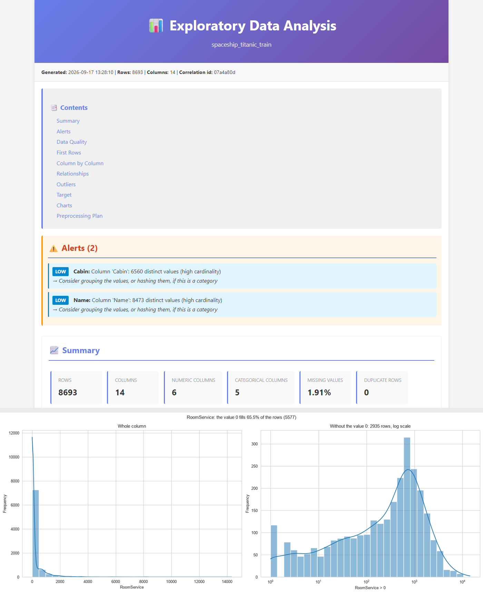

# EDA Pipeline

**One command turns any tabular file into a self-contained HTML report** — data quality, statistics,
outliers, relationships, target analysis, 40+ charts, and a preprocessing plan where every
recommendation carries the measurement that produced it.




<sub>A real report from `data/raw/spaceship_titanic_train.csv` (8 693 × 14). Below the summary, the chart
the pipeline drew for `RoomService`: 65.5% of its rows are 0, so the column is drawn a second time
without them — that is the only way its distribution is visible at all.</sub>

---

## Quick start

```bash
python -m venv .venv && .venv/Scripts/activate   # source .venv/bin/activate on Linux/macOS
python -m pip install -e .

# any CSV, TSV, Excel, Parquet or JSON file; --target is optional
python -m eda_pipeline analyze-file your_data.csv --target your_label_column
```

That writes one folder under `reports/`:

```
reports/your_data_20260917_112601/
├── report.html      # the whole report, offline, images embedded — just open it
├── summary.json     # every measurement, machine-readable
├── plots/           # one PNG per chart (40 for the report above)
└── tables/          # 7 CSV tables (stats, correlations, outliers, alerts, the plan)
```

The report in the screenshot came from Kaggle's Spaceship Titanic training file. `data/` is not
tracked, so bring your own — the pipeline detects delimiter, encoding, decimal separator and column
types on its own.

`analyze-batch <folder>` does the same for every supported file in a folder (CSV, TSV, Excel,
Parquet, JSON/JSONL), grouping the reports of one run into a single folder. A file that fails does
not abort the rest. `init-config` writes a YAML you can edit to override anything: delimiters,
encodings, column types, thresholds, which charts to draw.

Run `python -m eda_pipeline --help` for the rest.

## What the report contains

| Section | What you get |
|---|---|
| Data quality | Missing values, duplicates, constant and quasi-constant columns, high cardinality, mixed types, numbers stored as text |
| Type inference | Each column classified as continuous, discrete, categorical, boolean, datetime, time of day, text, identifier or constant — this is what decides the analysis it receives |
| Univariate | Descriptive statistics, normality tests, frequency tables, histograms and boxplots |
| Outliers | IQR, MAD z-score and a multivariate Isolation Forest whose cut is drawn from each dataset's own anomaly scores |
| Relationships | Pearson, Cramér's V, correlation ratio, VIF, two heatmaps, scatter plots of the strongest pairs and a pair plot coloured by group |
| Target analysis | Class balance, leakage checks, and the features most related to the target on one 0-to-1 scale |
| Preprocessing plan | What to convert, drop, impute, encode and scale — every line with the measurement behind it |

## Rules you can check

Automatic advice is easy to write and hard to trust. Two things keep this one honest.

**Every threshold was measured before it was written.** Not chosen by convention — measured across
the 24 datasets in `data/raw` (92 distinct numeric columns, 89 categorical ones), and the code
comments say what the measurement showed. For example, a column is drawn on a log scale when the
middle 90% of its rows takes less than 30% of the axis, the log at least doubles that span, and at
most 5% of its values are 0 or negative. Two simpler candidates were measured first and rejected:
skewness picks columns that already read well, and a p99/p1 ratio picks columns the log does not
help.

**Every recommendation shows its evidence.** The plan never says "impute with the median" alone —
this is one row of it, as the report prints it:

```text
Age    Fill in with the median (27.00)
       2.1% missing. The mean (28.83) sits 0.13 standard deviations away
       from the median, pulled by the tail
```

The median is the value to fill with because the mean is not where the middle is, and the line says
by how much. You can check that without trusting it.

And the plan states what it will not decide: whether a categorical column is *ordinal* (over the 89
categorical columns of the corpus, an automatic rule gets the order right on none of them) and
whether your model needs scaling at all. It reports the measured fact — these spreads are
incomparable — and leaves that call to you.

## Built with AI, verified like production code

The whole pipeline was written and is maintained with [Claude Code](https://claude.com/claude-code),
under a workflow that treats AI output as a proposal to be checked, never as a result. Every change
arrives as a pull request that states what was measured, what the rule picks and what it leaves out;
a human reviews and merges it:

- **Measure first.** No rule ships before it is run over the 24 real datasets and the output read
  against the raw CSVs. Reading that output is what catches the mistakes: it is how the preprocessing
  plan stopped offering to one-hot-encode a rating that was really 1 464 numbers stored as text.
- **Tests before code.** Every rule has tests that were seen failing first — 315 of them, 0 failures,
  no warnings, 92% coverage, `ruff` clean.
- **One change per pull request.** 38 merged PRs, each with what was measured, what it picks and
  what it deliberately leaves out.
- **Independent verification.** 50 defects have been found and fixed this way, including in work the
  AI itself produced: an agent once reported "ruff 100% clean" when it was not, and reading a
  generated report found an identifier topping the feature-importance table with a perfect score.

That last part is the point: an EDA tool that quietly reports 58% of your rows as outliers is worse
than no tool. It did, once — `RoomService` is 0 on 65.5% of its rows, so a quartile sat on that 0 and
the IQR fence measured the zeros instead of the spread. Nothing crashed and every number in the
report matched the raw file; it took reading the report line by line against the data to see it.

## Project layout

```
src/eda_pipeline/       loading · type inference · data quality · univariate · outliers ·
                        relationships · target · recommendations · charts · HTML report
tests/                  315 tests, unit and integration, 92% coverage
config/default.yaml     every threshold, overridable per run
data/raw/               the datasets the rules were measured on (not tracked)
IMPLEMENTATION_PLAN.md  27 stages, each with its measurements and what was verified
```

Each analysis step runs in isolation: if one fails, its traceback is logged with the run's
correlation id, the step is listed in `summary.json → failed_steps` and the report is still produced.

## Notes and roadmap

- **The CLI messages are still Spanish** (`--help`, the console output and the logs). The report
  itself — every section, chart, table and recommendation — is English; the CLI is next.
- Reports are self-contained, so they get large on very wide datasets (>100 columns). Chart counts
  are configurable.
- Next: generated scikit-learn preprocessing code, ordinal levels declared in the config, missingness
  that carries signal, text analysis (TF-IDF, topic modelling), and schema validation.

## License

MIT
